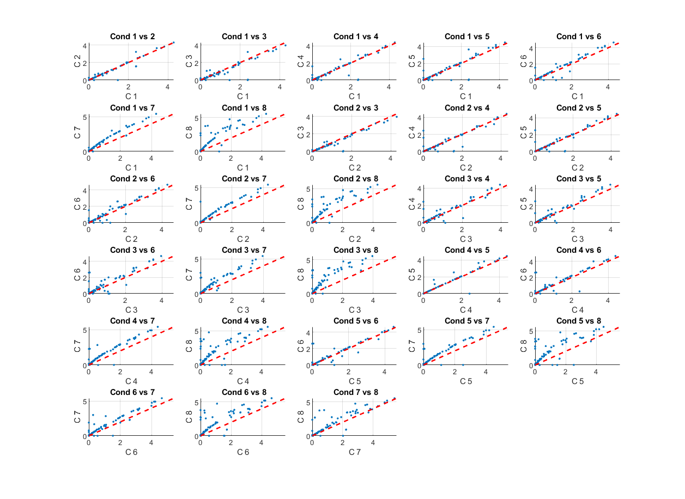
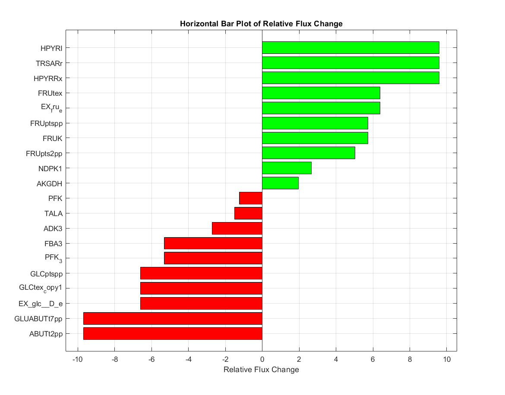
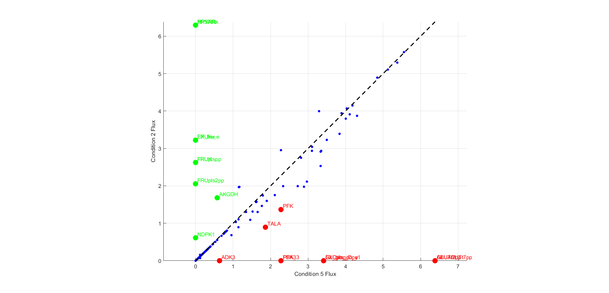

# IGM
A MILP-Based Approach for Multi-Condition Integration of Gene Expression into Genome-Scale Metabolic Models

This document covers instruction on how to run the IGM method in MATLAB.

**Alternative way**: This model is developed in App Designer. To use it with minimal coding, download **IGMAPP.mlappinstall** and follow the instructions in **Instruction for IGM App.pdf**.

Developers who wish to extend our method should follow the instructions below.

## REQUIREMENTS ##
1. **Matlab** (version R2023a or better)
2. **Cobra Toolbox** ([Installation Guide] https://opencobra.github.io/cobratoolbox/stable/installation.html )
2. **Gurobi solver** (version 11.0.3 or better, free academic)
3. **Genome scale metabolic model** ([Download from BiGG Models] http://bigg.ucsd.edu/ and iML1515 can be downloaded from http://bigg.ucsd.edu/models/iML1515 )
4. **Gene expression data file**
5. **Uptake rates data file**

**Notes:**  
- The first column of the gene expression file must contain **gene symbols/names** used in the genome-scale metabolic model.  
- The first column of the uptake rates file must contain **reaction IDs** used in the model.  
- The first row in both files must contain the **condition names**, and these names should match between files.  

## Usage ##
Step 1. Open Matlab program and enter:

    >> initCobraToolbox;

at Matlab command line.

Step 2. Read SBML model

    >> model = readCbModel('model_name');

Step 3. Read gene expression data

    >> geneexpressionTable = readtable('gene_expression_profile_file.csv');

Step 4. Read uptake rates data

    >> uptakeRatesTable = readtable('uptake_rates_file.csv');

Step 5. Perform analysis

    >> [modelIGM solIGM] = IGMRUN(model, uptakeRatesTable, geneexpressionTable, condition, normalizemethod, method)

## Visualization ##

SCATTERPLOTCOMPAREFLUX - Generate pairwise scatter plots to compare flux values
    >> scatterplotcompareflux(solIGM, conditionIdx, filtervalue)
    
    where   solIGM        :    Structure containing the optimization results from IGM model
            conditionIdx  :     vector of indices (relative to fluxTable columns, excluding first column)
                                specifying which conditions to compare
            filtervalue   :     threshold to filter out fluxes within range [-filtervalue, +filtervalue]

PLOTCOMPARETWOCOND - Compare flux distributions between two conditions and identify top reaction fluxes change
    >> relativeFluxTable = plotcomparetwocond(solIGM, conditionIdx, filtervalue, top)
    
    where    solIGM        :     Structure containing the optimization results from IGM model
             conditionIdx  :     vector of 2 indices (relative to fluxTable columns, excluding first column)
                                   specifying which two conditions to compare
             filtervalue   : threshold to filter out fluxes with values in [-filtervalue, +filtervalue]
             top           : number of top up- and down-regulated fluxes to display
    

## Function Description for IGMRUN ##
 **INPUTS:**
 
    model:                 COBRA model structure (genome-scale metabolic model).

    uptakeRatesTable:      Table of uptake rates where each column represents a condition 
                           and each row corresponds to a reaction flux.
                           The reaction list must match the reactions in the metabolic model.

    geneexpressionTable:   Table of gene expression profiles where each column represents a 
                           condition and each row corresponds to a gene in the metabolic model.

 **OPTIONAL INPUTS:**
 
    condition:             Row vector specifying the condition indices corresponding to 
                           the columns in geneexpressionTable.
                           Examples:
                               1:3       → conditions 1 to 3
                               [1:5,7:8] → conditions 1 to 8 excluding condition 6
                           Default: all conditions.
    normalizemethod:       Method for normalizing gene expression data for each gene (row) 
                           to relative values. Options:
                               'max'    → use the maximum value in each row as the reference
                               'maxmin' → use min-max scaling
                               'mean'   → use the mean value in each row as the reference midpoint
                           Default: 'mean'
    method:                Method for solving the optimization problem:
                               'IGM' → IGM without additional regularization
                               'L1'  → IGM with L1 norm regularization
                               'L2'  → IGM with L2 norm regularization

 **OUTPUTS:**
 
    modelIGM:              IGM optimization model incorporating relative gene expression data.
    solIGM:                Structure containing the optimization results:
                               solIGM.v   → reaction flux distribution for each condition
                               solIGM.x   → solution values for all variables in each condition
                               solIGM.f   → optimal objective value for each condition
                           L1-norm regularization results (if method = 'L1'):
                               solIGM.vL1 → reaction flux distribution for each condition using L1 norm
                               solIGM.xL1 → solution values for all variables in each condition using L1 norm
                               solIGM.fL1 → optimal objective value for each condition using L1 norm
                           L2-norm regularization results (if method = 'L2'):
                               solIGM.vL2 → reaction flux distribution for each condition using L2 norm
                               solIGM.xL2 → solution values for all variables in each condition using L2 norm
                               solIGM.fL2 → optimal objective value for each condition using L2 norm

 **EXAMPLES:**
 
Run with default settings (IGM without regularization):
    >> [modelIGM, solIGM] = IGMRUN(model, uptakeRatesTable, geneexpressionTable)

Run with L1-norm regularization:
    >> [modelIGM, solIGM] = IGMRUN(model, uptakeRatesTable, geneexpressionTable, 1:3, 'maxmin', 'L1')

Run with L2-norm regularization:
    >>[modelIGM, solIGM] = IGMRUN(model, uptakeRatesTable, geneexpressionTable, [1:5,7:8], 'mean', 'L2')

## Citation ##
In progress.

